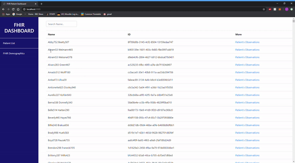

# GOSH-FHIRworks2020-FHIRDataVisualization

## 1. Setting up

- **Windows**

  1. Ensure that Python 3.7 or above is installed.
  2. pip install virtualenv
  3. virtualenv env
  4. pip install -r .\requirements.txt
  5. \$env:FLASK_ENV = "development"
  6. \$env:FLASK_APP = "app.py"

- **Linux**

  1. Ensure that Python 3.7 or above is installed.
  2. Install virtualenv and setup virtualenv

     - `pip install virtualenv`
     - `virtualenv env`

  3. Install packages

     - pip install -r .\requirements.txt

  4. Setup Flask environment
     - `export FLASK_ENV=development`
     - `export FLASK_APP=app.py`

## 2. Starting the FHIR WebApp

1. Clone the repo from [GOSH-FHIRworks2020](https://github.com/greenfrogs/FHIRworks_2020) and follow the deployment guide found on the repo. Ensure that the dotnet backend is running before you continue from this step.

2. Launching the FHIR Webapp

- **Windows**
  - `.\env\Scripts\activate`
  - `flask run --port=2000`
- **Linux**
  - `source env/bin/activate`
  - `flask run --port=2000`

## 3. API Endpoints

**Demographic Groups**

- GET demographic groups found in FHIR and returned as a dictionary such groups includes { 'age': {}, 'marital': {}, 'gender': {}, 'location':{}, 'race':{}, 'language':{}}: `/demographics`

**Patient's Observations Data**

- GET observations returns the patient observation data across the timescale, descriptions and key data of the latest observations: `/patientObs/patient ID`

## 4. FHIR WebApp Funtionalities

The dashboard can be used to display a list of patients, their observational data(latest observation uuid, date of observation, status, weight, bmi, systolic blood pressure) and more specific credentials such as (uuid, patient id, gender, address, birth date) along with a few graphs to allow users to properly visualize data across a time scale.

Clicking on the FHIR Demographics button will display a few graphs that shows the different demographical groups found on the FHIR database. Such groups includes the age group, location group, languages group etc.

There is also a search bar that allows users to search through the patient list on the homepage to find for a specific patient through the patient's name.

Routes

- `/` -- Homepage, also the list of patients
- `/patientObs/<patient id>` -- Patient's detailed credentials and observational data
- `/demographics` -- Data on the different demographical groups on the FHIR database
